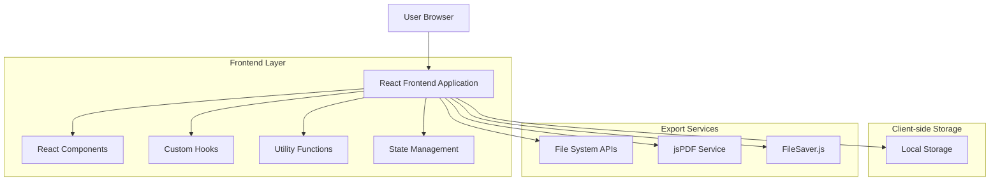
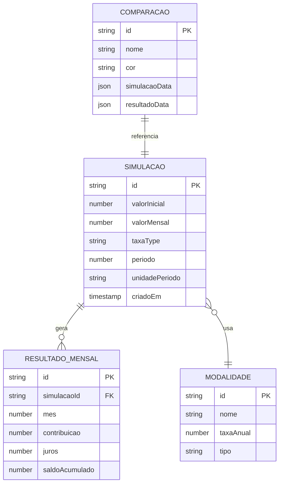
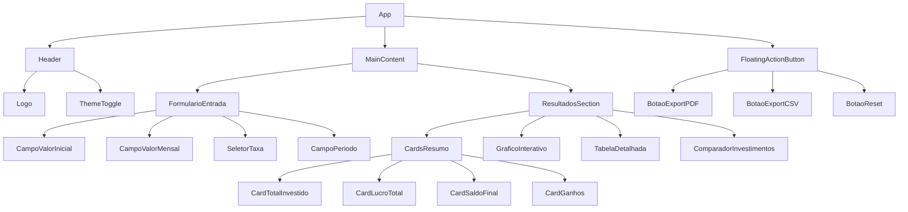

# Calculadora de Juros Compostos - Documento de Arquitetura Técnica

## 1. Architecture design



## 2. Technology Description

- Frontend: React@18 + TailwindCSS@3 + Vite
- Charts: Recharts@2.8
- Animations: Framer Motion@10
- PDF Export: jsPDF@2.5 + jspdf-autotable@3.6
- CSV Export: FileSaver.js@2.0
- Icons: Lucide React@0.263
- Backend: None (aplicação client-side)

## 3. Route definitions

| Route | Purpose |
|-------|---------|
| / | Página principal da calculadora com todas as funcionalidades |

## 4. API definitions

Como esta é uma aplicação client-side, não há APIs REST tradicionais. No entanto, temos as seguintes interfaces de dados:

### 4.1 Core Types

```typescript
// Tipos de taxa de juros
type TaxaType = 'banco' | 'cdi' | 'personalizada';

// Modalidades de investimento pré-cadastradas
type ModalidadeInvestimento = {
  id: string;
  nome: string;
  taxaAnual: number;
  tipo: 'poupanca' | 'cdb' | 'lci_lca' | 'tesouro';
};

// Dados de entrada da simulação
type SimulacaoInput = {
  valorInicial: number;
  valorMensal: number;
  taxaType: TaxaType;
  modalidade?: ModalidadeInvestimento;
  cdiAtual?: number;
  percentualCdi?: number;
  taxaPersonalizada?: number;
  periodo: number;
  unidadePeriodo: 'meses' | 'anos';
};

// Resultado de um mês específico
type ResultadoMensal = {
  mes: number;
  contribuicao: number;
  juros: number;
  saldoAcumulado: number;
};

// Resultado completo da simulação
type ResultadoSimulacao = {
  totalInvestido: number;
  totalJuros: number;
  saldoFinal: number;
  ganhoDiario: number;
  ganhoMensal: number;
  ganhoAnual: number;
  evolucaoMensal: ResultadoMensal[];
  taxaEfetivaMensal: number;
  taxaEfetivaDiaria: number;
};

// Dados para comparação
type ComparacaoInvestimento = {
  id: string;
  nome: string;
  simulacao: SimulacaoInput;
  resultado: ResultadoSimulacao;
  cor: string;
};
```

### 4.2 Utility Functions

```typescript
// Função principal de cálculo de juros compostos
function calcularJurosCompostos(input: SimulacaoInput): ResultadoSimulacao

// Conversão de taxa anual para mensal
function taxaAnualParaMensal(taxaAnual: number): number

// Conversão de taxa anual para diária
function taxaAnualParaDiaria(taxaAnual: number): number

// Formatação de valores monetários
function formatarMoeda(valor: number): string

// Exportação para PDF
function exportarPDF(dados: ResultadoSimulacao[], nomes: string[]): void

// Exportação para CSV
function exportarCSV(dados: ResultadoMensal[], nomeArquivo: string): void
```

## 5. Data model

### 5.1 Data model definition



### 5.2 Data Definition Language

Como esta é uma aplicação client-side, os dados são armazenados no localStorage do navegador:

```javascript
// Estrutura do localStorage
const localStorageKeys = {
  TEMA_PREFERIDO: 'calculadora_tema',
  SIMULACOES_SALVAS: 'calculadora_simulacoes',
  COMPARACOES_ATIVAS: 'calculadora_comparacoes',
  CONFIGURACOES: 'calculadora_config'
};

// Modalidades pré-cadastradas (dados estáticos)
const modalidadesPadrao = [
  {
    id: 'poupanca',
    nome: 'Poupança',
    taxaAnual: 6.17,
    tipo: 'poupanca'
  },
  {
    id: 'cdb_100',
    nome: 'CDB 100% CDI',
    taxaAnual: 13.75,
    tipo: 'cdb'
  },
  {
    id: 'cdb_110',
    nome: 'CDB 110% CDI',
    taxaAnual: 15.13,
    tipo: 'cdb'
  },
  {
    id: 'lci_90',
    nome: 'LCI 90% CDI',
    taxaAnual: 12.38,
    tipo: 'lci_lca'
  },
  {
    id: 'tesouro_selic',
    nome: 'Tesouro Selic',
    taxaAnual: 13.75,
    tipo: 'tesouro'
  }
];

// Função para salvar simulação no localStorage
function salvarSimulacao(simulacao) {
  const simulacoesSalvas = JSON.parse(
    localStorage.getItem(localStorageKeys.SIMULACOES_SALVAS) || '[]'
  );
  simulacoesSalvas.push({
    ...simulacao,
    id: Date.now().toString(),
    criadoEm: new Date().toISOString()
  });
  localStorage.setItem(
    localStorageKeys.SIMULACOES_SALVAS, 
    JSON.stringify(simulacoesSalvas)
  );
}

// Função para carregar tema preferido
function carregarTemaPreferido() {
  return localStorage.getItem(localStorageKeys.TEMA_PREFERIDO) || 'light';
}

// Função para salvar comparações ativas
function salvarComparacoes(comparacoes) {
  localStorage.setItem(
    localStorageKeys.COMPARACOES_ATIVAS,
    JSON.stringify(comparacoes)
  );
}
```

## 6. Component Architecture

### 6.1 Component Structure



### 6.2 Custom Hooks

```typescript
// Hook para cálculos de juros compostos
function useJurosCompostos(input: SimulacaoInput): ResultadoSimulacao

// Hook para gerenciamento de tema
function useTheme(): [string, (theme: string) => void]

// Hook para comparação de investimentos
function useComparacao(): {
  comparacoes: ComparacaoInvestimento[];
  adicionarComparacao: (simulacao: SimulacaoInput, nome: string) => void;
  removerComparacao: (id: string) => void;
  limparComparacoes: () => void;
}

// Hook para exportação de dados
function useExport(): {
  exportarPDF: (dados: ResultadoSimulacao[], nomes: string[]) => void;
  exportarCSV: (dados: ResultadoMensal[], nome: string) => void;
}

// Hook para persistência local
function useLocalStorage<T>(key: string, defaultValue: T): [T, (value: T) => void]
```