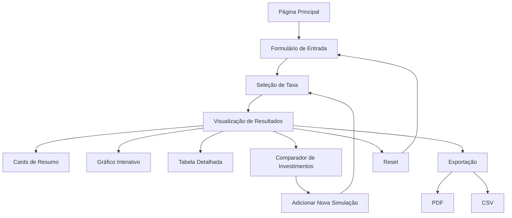

# Calculadora de Juros Compostos - Documento de Requisitos do Produto (PRD)

## 1. Product Overview

Uma aplicação web profissional para simulação de investimentos com juros compostos, oferecendo cálculos precisos, visualizações interativas e comparação de diferentes modalidades de investimento.

O produto resolve a necessidade de investidores planejarem seus investimentos de forma visual e precisa, permitindo comparar diferentes opções de investimento e exportar relatórios detalhados. Destinado a investidores iniciantes e experientes que buscam uma ferramenta confiável para simulações financeiras.

O objetivo é democratizar o acesso a ferramentas de planejamento financeiro profissional, oferecendo uma interface moderna e intuitiva tanto para desktop quanto mobile.

## 2. Core Features

### 2.1 User Roles

| Role | Registration Method | Core Permissions |
|------|---------------------|------------------|
| Usuário Geral | Acesso direto (sem registro) | Pode usar todas as funcionalidades de cálculo, visualização e exportação |

### 2.2 Feature Module

Nossa aplicação de calculadora de juros compostos consiste nas seguintes páginas principais:

1. **Página Principal**: formulário de entrada de dados, cards de resumo, gráfico interativo, tabela detalhada, comparador de investimentos.
2. **Modal de Configurações**: alternância de tema claro/escuro, configurações de exportação.

### 2.3 Page Details

| Page Name | Module Name | Feature description |
|-----------|-------------|---------------------|
| Página Principal | Header/Topbar | Exibir logo da aplicação, botão de alternância de tema (claro/escuro), título da página |
| Página Principal | Formulário de Entrada | Capturar valor inicial do investimento, valor mensal, tipo de taxa (Banco/CDI/Personalizada), período de investimento |
| Página Principal | Seletor de Taxa | Permitir escolha entre modalidades pré-cadastradas (Poupança, CDB, LCI/LCA), CDI com percentual, ou taxa personalizada anual |
| Página Principal | Cards de Resumo | Exibir total investido, lucro total, saldo final, ganhos diário/mensal/anual com formatação monetária |
| Página Principal | Gráfico Interativo | Mostrar evolução do saldo mês a mês usando Recharts, tooltips animados, zoom e pan |
| Página Principal | Tabela Detalhada | Listar mês, contribuição mensal, juros do mês, saldo acumulado com paginação e ordenação |
| Página Principal | Comparador de Investimentos | Permitir adicionar até 3 simulações diferentes, exibir no mesmo gráfico com cores distintas, mostrar qual rendeu mais |
| Página Principal | Botões de Exportação | Gerar PDF com gráfico e tabela usando jsPDF, exportar CSV usando FileSaver.js, resetar simulação |
| Página Principal | FAB Mobile | Botão flutuante com ações rápidas (PDF, CSV, Reset) otimizado para dispositivos móveis |
| Modal de Configurações | Configurações de Tema | Alternar entre modo claro e escuro, salvar preferência no localStorage |

## 3. Core Process

**Fluxo Principal do Usuário:**

1. O usuário acessa a página principal da calculadora
2. Preenche o formulário com dados do investimento (valor inicial, contribuição mensal, tipo de taxa, período)
3. Seleciona o tipo de taxa desejada (banco pré-cadastrado, CDI com percentual, ou taxa personalizada)
4. Visualiza automaticamente os resultados nos cards de resumo, gráfico e tabela
5. Opcionalmente, adiciona mais simulações no comparador (até 3 total)
6. Exporta os resultados em PDF ou CSV conforme necessário
7. Pode resetar a simulação para começar nova análise

**Fluxo de Comparação de Investimentos:**

1. Após criar a primeira simulação, o usuário clica em "Adicionar Comparação"
2. Preenche dados para segunda simulação com taxa diferente
3. Visualiza ambas no mesmo gráfico com cores distintas
4. Repete o processo para terceira simulação se desejar
5. Analisa qual investimento teve melhor performance e diferença em valores

## 4. User Interface Design

### 4.1 Design Style

- **Cores Primárias**: Verde (#10B981) para ganhos/positivo, Azul (#3B82F6) para neutro, Vermelho (#EF4444) para perdas
- **Cores Secundárias**: Cinza (#6B7280) para textos secundários, Branco (#FFFFFF) e Preto (#1F2937) para fundos
- **Estilo de Botões**: Arredondados (rounded-lg), com sombras suaves, efeitos hover com transições
- **Fontes**: Inter ou system fonts, tamanhos 14px (corpo), 18px (títulos), 24px (valores principais)
- **Layout**: Card-based com sombras (shadow-md), cantos arredondados (rounded-2xl), espaçamento consistente
- **Ícones**: Lucide React ou Heroicons, estilo outline, tamanho 20px-24px
- **Animações**: Transições suaves (300ms), fade-in para cards, slide para modais

### 4.2 Page Design Overview

| Page Name | Module Name | UI Elements |
|-----------|-------------|-------------|
| Página Principal | Header | Fundo gradiente sutil, logo à esquerda, botão de tema à direita, sombra inferior |
| Página Principal | Formulário de Entrada | Cards brancos com sombra, inputs com bordas arredondadas, labels em cinza, validação visual |
| Página Principal | Cards de Resumo | Grid responsivo, ícones coloridos, valores em destaque, animação de contagem |
| Página Principal | Gráfico | Fundo branco/escuro, linhas suaves, cores vibrantes, tooltips com sombra |
| Página Principal | Tabela | Zebra striping, headers fixos, scroll horizontal mobile, paginação inferior |
| Página Principal | FAB Mobile | Botão circular verde, ícones brancos, sombra pronunciada, posição fixa inferior direita |

### 4.3 Responsiveness

O produto é **mobile-first** com adaptação progressiva para desktop:

- **Mobile (320px-768px)**: Layout em coluna única, FAB para ações, gráfico com scroll horizontal, inputs grandes para toque
- **Tablet (768px-1024px)**: Layout híbrido, alguns elementos lado a lado, FAB opcional
- **Desktop (1024px+)**: Layout duas colunas (formulário esquerda, resultados direita), hover states, tooltips avançados

Otimizações para toque incluem botões mínimo 44px, espaçamento adequado entre elementos clicáveis, e feedback visual imediato para interações.