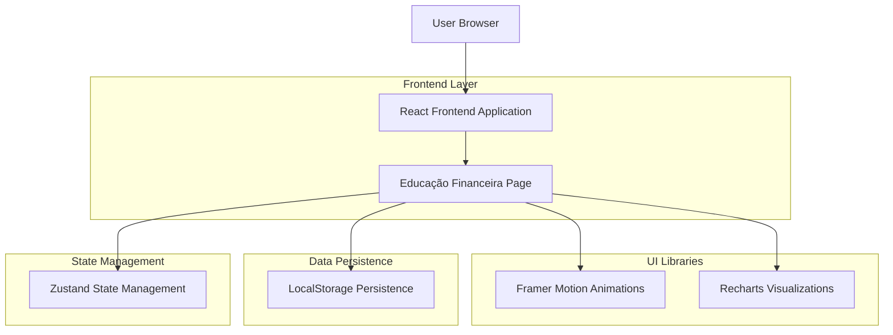
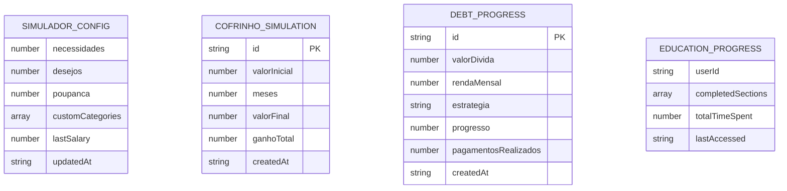

# Arquitetura Técnica - Página de Educação Financeira

## 1. Architecture design



## 2. Technology Description

- Frontend: React@18 + TypeScript + Vite + TailwindCSS@3
- Animations: Framer Motion@10
- Charts: Recharts@2.8
- State Management: Zustand (existing)
- Icons: Lucide React (existing)
- Persistence: LocalStorage API
- Styling: TailwindCSS with custom theme integration

## 3. Route definitions

| Route | Purpose |
|-------|---------|
| /educacao-financeira | Página principal de educação financeira com todas as seções |
| /educacao-financeira#educacao | Âncora para seção de educação animada |
| /educacao-financeira#simulador | Âncora para simulador 50-30-20 |
| /educacao-financeira#dividas | Âncora para soluções de dívidas |
| /educacao-financeira#cofrinho | Âncora para cofrinho inteligente |

## 4. API definitions

### 4.1 LocalStorage Interface

**Simulador 50-30-20 Configuration**
```typescript
interface SimuladorConfig {
  necessidades: number; // Percentual para necessidades
  desejos: number; // Percentual para desejos  
  poupanca: number; // Percentual para poupança
  customCategories?: Array<{
    name: string;
    percentage: number;
    color: string;
  }>;
  lastSalary?: number; // Último salário informado
}
```

**Cofrinho Simulation History**
```typescript
interface CofrinhoHistory {
  simulations: Array<{
    id: string;
    valorInicial: number;
    meses: number;
    valorFinal: number;
    ganhoTotal: number;
    createdAt: string;
  }>;
}
```

**Debt Solutions Progress**
```typescript
interface DebtProgress {
  valorDivida: number;
  rendaMensal: number;
  estrategia: 'bola-de-neve' | 'avalanche' | 'minimo';
  progresso: number; // 0-100
  pagamentosRealizados: number;
  createdAt: string;
}
```

## 5. Server architecture diagram

Não aplicável - aplicação frontend com persistência local.

## 6. Data model

### 6.1 Data model definition



### 6.2 Data Definition Language

**LocalStorage Keys Structure**
```typescript
// Configuração do Simulador 50-30-20
const SIMULADOR_CONFIG_KEY = 'jurus:educacao:simulador-config';

// Histórico de simulações do Cofrinho
const COFRINHO_HISTORY_KEY = 'jurus:educacao:cofrinho-history';

// Progresso de quitação de dívidas
const DEBT_PROGRESS_KEY = 'jurus:educacao:debt-progress';

// Progresso educacional do usuário
const EDUCATION_PROGRESS_KEY = 'jurus:educacao:progress';

// Configurações de tema e preferências
const EDUCATION_PREFERENCES_KEY = 'jurus:educacao:preferences';
```

**Default Configuration Values**
```typescript
// Configuração padrão do simulador 50-30-20
const DEFAULT_SIMULADOR_CONFIG: SimuladorConfig = {
  necessidades: 50,
  desejos: 30,
  poupanca: 20,
  customCategories: [],
  lastSalary: 0
};

// Configuração padrão do CDI para cálculos
const CDI_CONFIG = {
  cdiAnual: 10.65, // 10.65% ao ano
  multiplicador: 1.20, // 120% do CDI
  cdiMensal: 1.01 // ~1.01% ao mês
};

// Estratégias de pagamento de dívidas
const DEBT_STRATEGIES = {
  'bola-de-neve': {
    name: 'Método Bola de Neve',
    description: 'Quite primeiro as menores dívidas',
    recommendedPercentage: 20
  },
  'avalanche': {
    name: 'Método Avalanche', 
    description: 'Quite primeiro as dívidas com maiores juros',
    recommendedPercentage: 25
  },
  'minimo': {
    name: 'Pagamento Mínimo',
    description: 'Pague o mínimo e negocie condições',
    recommendedPercentage: 15
  }
};
```

**Utility Functions for Calculations**
```typescript
// Cálculo do rendimento do cofrinho (120% CDI)
function calcularRendimentoCofrinho(valorInicial: number, meses: number): {
  valorFinal: number;
  ganhoTotal: number;
  crescimentoMensal: Array<{mes: number, valor: number}>;
} {
  const taxaMensal = 0.0101; // 1.01% ao mês
  const valorFinal = valorInicial * Math.pow(1 + taxaMensal, meses);
  const ganhoTotal = valorFinal - valorInicial;
  
  const crescimentoMensal = [];
  for (let i = 1; i <= meses; i++) {
    crescimentoMensal.push({
      mes: i,
      valor: valorInicial * Math.pow(1 + taxaMensal, i)
    });
  }
  
  return { valorFinal, ganhoTotal, crescimentoMensal };
}

// Cálculo de tempo para quitação de dívidas
function calcularTempoQuitacao(valorDivida: number, rendaMensal: number, percentualPagamento: number): {
  mesesParaQuitar: number;
  valorMensalRecomendado: number;
  estrategiaRecomendada: string;
} {
  const valorMensal = (rendaMensal * percentualPagamento) / 100;
  const meses = Math.ceil(valorDivida / valorMensal);
  
  let estrategia = 'minimo';
  if (percentualPagamento >= 25) estrategia = 'avalanche';
  else if (percentualPagamento >= 20) estrategia = 'bola-de-neve';
  
  return {
    mesesParaQuitar: meses,
    valorMensalRecomendado: valorMensal,
    estrategiaRecomendada: estrategia
  };
}
```