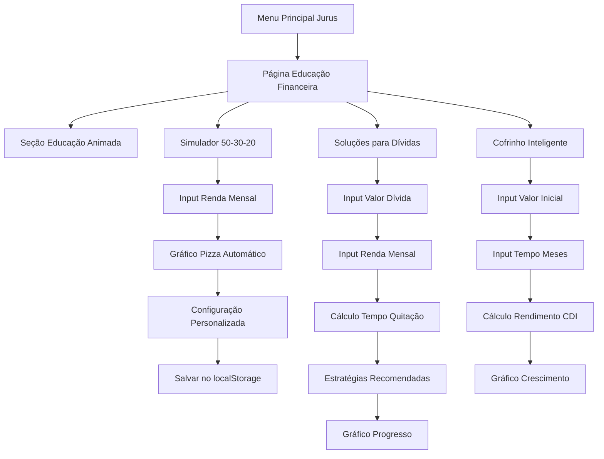

# PRD - Página de Educação Financeira

## 1. Product Overview

Uma página interativa de educação financeira integrada ao aplicativo Jurus, oferecendo aprendizado descomplicado através de animações, simulações práticas e recomendações inteligentes para gestão financeira pessoal.

O objetivo é democratizar o conhecimento financeiro através de uma experiência visual e interativa, ajudando usuários a desenvolver hábitos financeiros saudáveis e tomar decisões mais conscientes sobre dinheiro.

## 2. Core Features

### 2.1 User Roles
Não há distinção de papéis - todos os usuários têm acesso completo às funcionalidades educativas.

### 2.2 Feature Module

Nossa página de Educação Financeira consiste nas seguintes seções principais:

1. **Educação Financeira Animada**: cards interativos com conceitos fundamentais, animações explicativas e dicas práticas.
2. **Simulador 50-30-20**: ferramenta interativa para planejamento orçamentário com gráficos dinâmicos e configurações personalizadas.
3. **Soluções para Dívidas**: calculadora de quitação com estratégias automáticas e acompanhamento visual de progresso.
4. **Cofrinho Inteligente**: simulador de investimentos baseado no rendimento do Mercado Pago com projeções detalhadas.

### 2.3 Page Details

| Page Name | Module Name | Feature description |
|-----------|-------------|---------------------|
| Educação Financeira | Header Navigation | Navegação integrada com o sistema Jurus, breadcrumbs e menu responsivo |
| Educação Financeira | Educação Animada | Exibir cards coloridos com animações explicando conceitos básicos: controle de gastos, diferença entre gastar/poupar/investir, frases motivacionais |
| Educação Financeira | Simulador 50-30-20 | Calcular divisão orçamentária automática (50% necessidades, 30% desejos, 20% poupança), permitir configurações personalizadas, exibir gráfico de pizza animado, salvar preferências no localStorage |
| Educação Financeira | Soluções para Dívidas | Calcular tempo de quitação baseado em renda e valor da dívida, sugerir estratégias de pagamento (método bola de neve), exibir gráfico de progresso, mostrar mensagens motivacionais |
| Educação Financeira | Cofrinho Inteligente | Simular rendimento baseado em 120% do CDI (1,01% ao mês), calcular valor final e ganhos, exibir gráfico de crescimento mensal, mostrar explicação animada do produto |

## 3. Core Process

**Fluxo Principal do Usuário:**

1. O usuário acessa a página de Educação Financeira através do menu principal do Jurus
2. Visualiza os cards animados da seção educativa para aprender conceitos básicos
3. Utiliza o Simulador 50-30-20 inserindo sua renda mensal para ver a divisão recomendada
4. Personaliza os percentuais conforme suas necessidades e salva as configurações
5. Acessa a seção de Dívidas para calcular estratégias de quitação
6. Utiliza o Cofrinho Inteligente para simular investimentos e visualizar projeções
7. Navega entre as seções de forma fluida, com dados persistidos localmente

## 4. User Interface Design

### 4.1 Design Style

- **Cores Primárias**: Manter paleta do Jurus - azul (#3B82F6), verde (#10B981) para ganhos, vermelho (#EF4444) para dívidas
- **Cores Secundárias**: Gradientes suaves, tons pastéis para cards educativos
- **Estilo de Botões**: Rounded corners (8px), hover effects, micro-animações
- **Tipografia**: Inter font family, tamanhos hierárquicos (h1: 2.5rem, h2: 2rem, body: 1rem)
- **Layout**: Grid responsivo, cards com shadow e border-radius, espaçamento consistente (16px, 24px, 32px)
- **Ícones**: Lucide React icons, animações com Framer Motion, cores temáticas por seção
- **Animações**: Fade-in, slide-up, bounce effects, loading spinners, progress bars animadas

### 4.2 Page Design Overview

| Page Name | Module Name | UI Elements |
|-----------|-------------|-------------|
| Educação Financeira | Header | Breadcrumb navigation, título da página com ícone, tema toggle integrado |
| Educação Financeira | Educação Animada | Grid de 3 cards por linha (desktop), cards com gradientes coloridos, ícones animados (TrendingUp, PiggyBank, Target), textos em hierarquia clara, hover effects com scale transform |
| Educação Financeira | Simulador 50-30-20 | Input field estilizado para renda, gráfico de pizza com Recharts, cores distintas por categoria, labels percentuais, inputs range para configuração personalizada, botão "Salvar Configuração" |
| Educação Financeira | Soluções para Dívidas | Dois inputs lado a lado (valor dívida, renda), card de resultados com ícones de progresso, gráfico de barras para timeline de pagamento, badges para estratégias recomendadas, progress bar animada |
| Educação Financeira | Cofrinho Inteligente | Input valor inicial com formatação monetária, slider para meses, card de resultados com destaque para ganhos, gráfico de linha para crescimento temporal, tooltip explicativo animado, cores verde para rendimentos |

### 4.3 Responsiveness

- **Desktop-first** com adaptação mobile-responsive
- **Breakpoints**: sm (640px), md (768px), lg (1024px), xl (1280px)
- **Mobile**: Cards empilhados verticalmente, gráficos redimensionados, inputs full-width
- **Touch optimization**: Botões com min-height 44px, espaçamento adequado para toque
- **Tablet**: Layout híbrido com 2 colunas, gráficos em tamanho intermediário