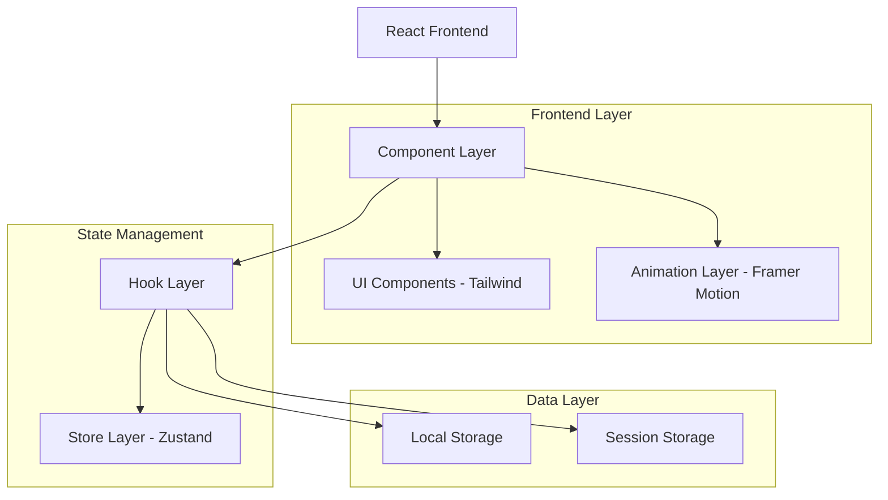

# Finalização de Páginas Dashboard - Arquitetura Técnica

## 1. Arquitetura do Sistema



## 2. Stack Tecnológico

- **Frontend**: React@18 + TypeScript + Vite
- **Styling**: Tailwind CSS@3 + Framer Motion
- **State Management**: Zustand + React Hooks
- **Routing**: React Router@6
- **Icons**: Lucide React
- **Build Tool**: Vite

## 3. Definição de Rotas

| Rota | Propósito |
|------|-----------|
| /dashboard | Dashboard básico com métricas essenciais |
| /dashboard-executivo | Dashboard gerencial com KPIs avançados |
| /dashboard-executivo-avancado | Analytics avançados e predições IA |
| /recomendacoes-ia | Sistema de recomendações inteligentes |
| /sistema-educacao | Plataforma de educação financeira |

## 4. Estrutura de Componentes

### 4.1 Componentes Principais

**Dashboard Básico**
```typescript
interface DashboardProps {
  simulacao?: SimulacaoInput;
  resultado?: ResultadoSimulacao;
}

// Componentes filhos:
// - MetricasBasicas
// - GraficoEvolucao
// - ResumoSimulacoes
// - AcoesRapidas
```

**Dashboard Executivo**
```typescript
interface DashboardExecutivoProps {
  periodo: 'mensal' | 'trimestral' | 'anual';
  comparativo: boolean;
}

// Componentes filhos:
// - KPIsGerenciais
// - AnaliseComparativa
// - AlertasRisco
// - TabelaPerformance
```

**Dashboard Executivo Avançado**
```typescript
interface DashboardExecutivoAvancadoProps {
  modoAnalise: 'preditivo' | 'historico' | 'cenarios';
  configuracoes: ConfiguracaoAvancada;
}

// Componentes filhos:
// - AnalyticsPreditivos
// - GestaoRisco
// - NotificacoesPrioritarias
// - SimulacaoCenarios
```

**Recomendações IA**
```typescript
interface RecomendacoesIAProps {
  perfilUsuario: PerfilInvestidor;
  carteira?: CarteiraAtual;
}

// Componentes filhos:
// - EngineRecomendacoes
// - OtimizacaoCarteira
// - ScoreConfianca
// - AcoesRecomendadas
```

**Sistema Educação**
```typescript
interface SistemaEducacaoProps {
  nivelUsuario: 'iniciante' | 'intermediario' | 'avancado';
  progressoAtual: ProgressoEducacao;
}

// Componentes filhos:
// - BibliotecaConteudo
// - CursosInterativos
// - SistemaGamificacao
// - AvaliacaoProgresso
```

## 5. Hooks Personalizados

### 5.1 Hooks de Dashboard

```typescript
// Hook para dashboard básico
export function useDashboard() {
  const [metricas, setMetricas] = useState<MetricasBasicas>();
  const [loading, setLoading] = useState(false);
  
  const calcularMetricas = useCallback(() => {
    // Lógica de cálculo
  }, []);
  
  return { metricas, loading, calcularMetricas };
}

// Hook para dashboard executivo
export function useDashboardExecutivo() {
  const [kpis, setKpis] = useState<KPIsGerenciais>();
  const [comparativos, setComparativos] = useState<DadosComparativos>();
  
  return { kpis, comparativos, atualizarDados };
}

// Hook para recomendações IA
export function useRecomendacoesIA() {
  const [recomendacoes, setRecomendacoes] = useState<Recomendacao[]>();
  const [confianca, setConfianca] = useState<number>();
  
  const gerarRecomendacoes = useCallback(() => {
    // Engine de IA para recomendações
  }, []);
  
  return { recomendacoes, confianca, gerarRecomendacoes };
}
```

### 5.2 Hooks de Estado Global

```typescript
// Store principal com Zustand
interface AppState {
  // Dashboard state
  dashboardData: DashboardData;
  setDashboardData: (data: DashboardData) => void;
  
  // Educação state
  progressoEducacao: ProgressoEducacao;
  setProgressoEducacao: (progresso: ProgressoEducacao) => void;
  
  // Recomendações state
  recomendacoesAtivas: Recomendacao[];
  setRecomendacoesAtivas: (recomendacoes: Recomendacao[]) => void;
}
```

## 6. Definições de Tipos

### 6.1 Tipos de Dashboard

```typescript
interface MetricasBasicas {
  valorTotal: number;
  rendimento: number;
  percentualGanho: number;
  tempoInvestido: number;
}

interface KPIsGerenciais {
  roi: number;
  volatilidade: number;
  sharpeRatio: number;
  maxDrawdown: number;
  benchmarkComparison: number;
}

interface ConfiguracaoAvancada {
  algoritmoIA: 'conservador' | 'moderado' | 'agressivo';
  horizonteTemporal: number;
  toleranciaRisco: number;
  objetivoFinanceiro: string;
}
```

### 6.2 Tipos de Educação

```typescript
interface ConteudoEducacional {
  id: string;
  titulo: string;
  tipo: 'artigo' | 'video' | 'curso' | 'quiz';
  nivel: 'iniciante' | 'intermediario' | 'avancado';
  duracao: number;
  pontuacao: number;
  tags: string[];
}

interface ProgressoEducacao {
  pontosTotal: number;
  nivel: number;
  badges: Badge[];
  cursosCompletos: string[];
  tempoEstudo: number;
}
```

### 6.3 Tipos de Recomendações

```typescript
interface Recomendacao {
  id: string;
  tipo: 'investimento' | 'rebalanceamento' | 'otimizacao';
  titulo: string;
  descricao: string;
  confianca: number;
  impactoEstimado: number;
  prazoImplementacao: string;
  acoes: AcaoRecomendada[];
}

interface AcaoRecomendada {
  id: string;
  descricao: string;
  prioridade: 'alta' | 'media' | 'baixa';
  executada: boolean;
}
```

## 7. Estrutura de Arquivos

```
src/
├── components/
│   ├── Dashboard.tsx                    # ✅ Finalizar
│   ├── DashboardExecutivo.tsx          # ✅ Finalizar  
│   ├── DashboardExecutivoAvancado.tsx  # ✅ Finalizar
│   ├── RecomendacoesIA.tsx             # ✅ Finalizar
│   ├── SistemaEducacao.tsx             # ✅ Finalizar
│   ├── RelatoriosAvancados.tsx         # ❌ Remover
│   └── SimuladorCenarios.tsx           # ❌ Remover
├── hooks/
│   ├── useDashboard.ts                 # ✅ Criar/Finalizar
│   ├── useDashboardExecutivo.ts        # ✅ Criar/Finalizar
│   ├── useRecomendacoesIA.ts           # ✅ Finalizar
│   └── useEducacao.ts                  # ✅ Finalizar
├── types/
│   ├── dashboard.ts                    # ✅ Criar
│   ├── recomendacoes.ts               # ✅ Finalizar
│   └── educacao.ts                     # ✅ Finalizar
└── utils/
    ├── dashboardCalculations.ts        # ✅ Criar
    ├── iaEngine.ts                     # ✅ Criar
    └── educacaoUtils.ts                # ✅ Finalizar
```

## 8. Plano de Implementação

### 8.1 Fase 1 - Remoção de Páginas Desnecessárias
1. Remover componentes `RelatoriosAvancados.tsx` e `SimuladorCenarios.tsx`
2. Atualizar `AppRouter.tsx` removendo rotas
3. Atualizar `Sidebar.tsx` removendo links de navegação
4. Limpar imports e referências

### 8.2 Fase 2 - Finalização de Dashboards
1. Completar `Dashboard.tsx` com métricas básicas
2. Finalizar `DashboardExecutivo.tsx` com KPIs gerenciais
3. Implementar funcionalidades avançadas em `DashboardExecutivoAvancado.tsx`

### 8.3 Fase 3 - Sistema de Recomendações IA
1. Finalizar engine de recomendações
2. Implementar sistema de confiança
3. Criar interface de ações recomendadas

### 8.4 Fase 4 - Sistema Educação
1. Completar biblioteca de conteúdo
2. Implementar sistema de gamificação
3. Finalizar tracking de progresso

### 8.5 Fase 5 - Otimização e Testes
1. Implementar lazy loading
2. Otimizar performance
3. Testes de responsividade
4. Validação de acessibilidade