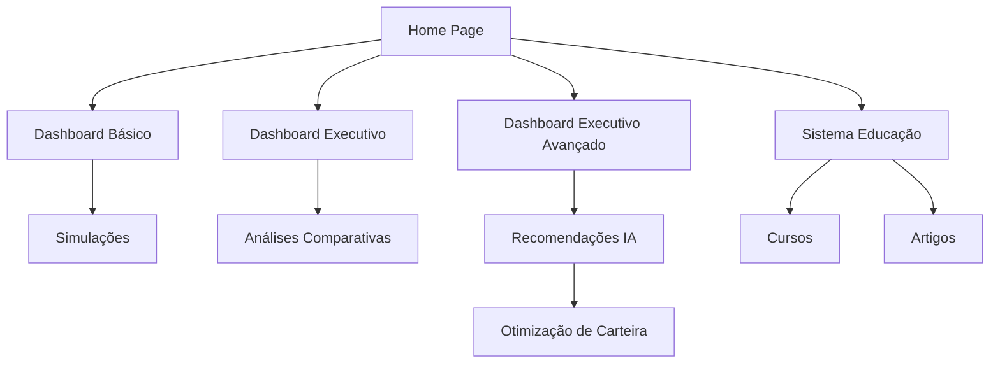

# Finalização de Páginas Dashboard - Documento de Requisitos

## 1. Visão Geral do Projeto

Este documento define os requisitos para finalizar o desenvolvimento de 5 páginas essenciais do sistema Jurus e remover 2 páginas desnecessárias, focando em criar uma experiência de usuário completa e otimizada para análise financeira e educação.

- **Objetivo Principal**: Completar funcionalidades críticas de dashboard e sistema educacional
- **Público-Alvo**: Usuários que precisam de análises financeiras avançadas e educação financeira
- **Valor do Produto**: Interface unificada para gestão financeira inteligente com IA

## 2. Funcionalidades Principais

### 2.1 Papéis de Usuário
| Papel | Método de Registro | Permissões Principais |
|-------|-------------------|----------------------|
| Usuário Básico | Acesso direto | Pode usar dashboard básico e sistema educação |
| Usuário Avançado | Configuração de perfil | Acesso completo a dashboards executivos e IA |

### 2.2 Módulos de Funcionalidades

Nossos requisitos consistem nas seguintes páginas principais:

1. **Dashboard**: painel básico com métricas essenciais, gráficos interativos, resumo de simulações
2. **Dashboard Executivo**: visão gerencial com KPIs, análises comparativas, alertas inteligentes
3. **Dashboard Executivo Avançado**: analytics avançados, predições IA, gestão de risco, notificações prioritárias
4. **Recomendações IA**: sugestões personalizadas, análise de perfil, otimização de carteira
5. **Sistema Educação**: cursos interativos, artigos, quizzes, progresso de aprendizado

### 2.3 Detalhes das Páginas

| Nome da Página | Módulo | Descrição da Funcionalidade |
|----------------|--------|----------------------------|
| Dashboard | Métricas Básicas | Exibir cards com valores principais, gráfico de evolução, resumo de simulações recentes |
| Dashboard | Navegação Rápida | Botões de acesso rápido para simulações, comparações e histórico |
| Dashboard Executivo | KPIs Gerenciais | Mostrar indicadores de performance, comparação com benchmarks, alertas de risco |
| Dashboard Executivo | Análise Comparativa | Gráficos comparativos entre diferentes investimentos e períodos |
| Dashboard Executivo Avançado | Analytics Avançados | Análise preditiva, simulação de cenários, gestão de risco avançada |
| Dashboard Executivo Avançado | Notificações Inteligentes | Sistema de alertas prioritários, recomendações automáticas |
| Recomendações IA | Engine de Sugestões | Analisar perfil do usuário e gerar recomendações personalizadas |
| Recomendações IA | Otimização de Carteira | Sugerir rebalanceamento e novos investimentos baseado em IA |
| Sistema Educação | Conteúdo Educacional | Biblioteca de artigos, cursos e vídeos sobre educação financeira |
| Sistema Educação | Gamificação | Sistema de pontos, badges e progresso de aprendizado |

## 3. Fluxo Principal de Usuário

O usuário navega entre diferentes níveis de complexidade de dashboards conforme sua necessidade:

**Fluxo Básico**: Dashboard → Simulações → Resultados
**Fluxo Executivo**: Dashboard Executivo → Análises → Recomendações IA
**Fluxo Educacional**: Sistema Educação → Cursos → Avaliações → Progresso

## 4. Design de Interface

### 4.1 Estilo de Design
- **Cores Primárias**: Azul (#3B82F6), Verde (#10B981) para ganhos, Vermelho (#EF4444) para perdas
- **Cores Secundárias**: Cinza (#6B7280) para textos, Branco/Preto para fundos
- **Estilo de Botões**: Arredondados com hover effects e animações suaves
- **Tipografia**: Inter ou system fonts, tamanhos 14px-24px
- **Layout**: Grid responsivo, cards com sombras suaves, navegação lateral
- **Ícones**: Lucide React com estilo minimalista

### 4.2 Visão Geral do Design das Páginas

| Nome da Página | Módulo | Elementos de UI |
|----------------|--------|-----------------|
| Dashboard | Cards de Métricas | Layout em grid 2x2, cards com ícones coloridos, valores destacados, gráficos sparkline |
| Dashboard | Gráfico Principal | Gráfico de linha interativo, filtros de período, tooltips informativos |
| Dashboard Executivo | KPIs Executivos | Cards maiores com comparações, indicadores de tendência, cores semafóricas |
| Dashboard Executivo | Tabela Comparativa | Tabela responsiva com sorting, filtros, exportação |
| Dashboard Executivo Avançado | Analytics Avançados | Gráficos complexos, heatmaps, dashboards multi-dimensionais |
| Dashboard Executivo Avançado | Alertas Prioritários | Notificações em tempo real, badges de prioridade, ações rápidas |
| Recomendações IA | Cards de Sugestões | Layout de cards com scores de confiança, botões de ação, explicações detalhadas |
| Sistema Educação | Biblioteca de Conteúdo | Grid de cards com preview, filtros por categoria, barra de progresso |

### 4.3 Responsividade
- **Desktop-first** com adaptação para mobile
- **Breakpoints**: sm (640px), md (768px), lg (1024px), xl (1280px)
- **Touch optimization** para dispositivos móveis
- **Navegação adaptativa** com menu hambúrguer em mobile

## 5. Páginas para Remoção

### 5.1 Relatórios Avançados
- **Motivo da Remoção**: Funcionalidade redundante com dashboards executivos
- **Ações**: Remover componente, rotas e referências na navegação

### 5.2 Simulador Cenários  
- **Motivo da Remoção**: Funcionalidade integrada ao dashboard executivo avançado
- **Ações**: Migrar funcionalidades essenciais para dashboard avançado, remover componente independente

## 6. Requisitos Técnicos

### 6.1 Performance
- **Lazy loading** para todos os componentes de página
- **Memoização** de cálculos complexos
- **Otimização de re-renders** com React.memo
- **Bundle splitting** por rota

### 6.2 Acessibilidade
- **ARIA labels** em todos os elementos interativos
- **Navegação por teclado** completa
- **Contraste de cores** WCAG AA
- **Screen reader** compatibility

### 6.3 Integração
- **Hooks personalizados** para lógica de negócio
- **Zustand store** para estado global
- **React Query** para cache de dados
- **Framer Motion** para animações

### 6.4 Responsividade
- **Mobile-first** approach
- **Flexbox/Grid** layouts
- **Tailwind CSS** para styling
- **Breakpoints consistentes** em todas as páginas